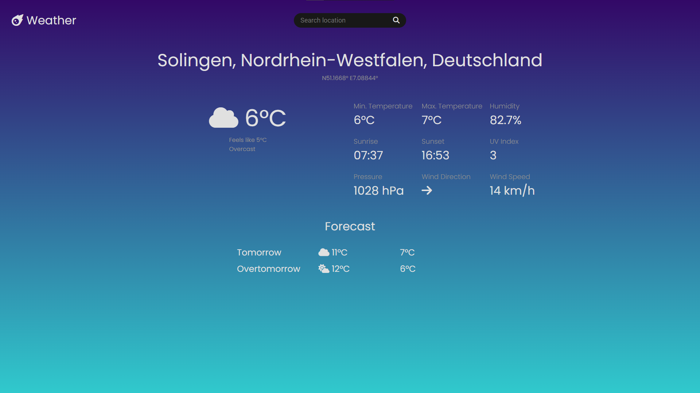

# Weather App
 
A weather app build with Webpack and JavaScript.


[Live View](https://deucenn.github.io/better-weather-app/)



----------------------------------------------------------------
 
## Features

- **Real-Time Weather Search**: Users can search for weather information by city name, retrieving up-to-date data for any location.
- **Default Location Data**: Automatically loads weather information for a standard location (e.g., Solingen) when the app first opens.
- **Detailed Weather Information**: Displays comprehensive weather data, including temperature, humidity, UV index, wind speed, pressure, sunrise/sunset times, and a short description of current conditions.
- **Weather Icon and Directional Icons**: Uses Font Awesome icons to visually represent weather conditions and wind direction, providing a clear and engaging UI.
- **Temperature Unit Conversion**: Converts temperatures from Fahrenheit to Celsius, ensuring data is accessible to users familiar with Celsius.
- **Responsive UI Updates**: Weather data updates dynamically in the UI without requiring a page reload, providing a seamless user experience.
- **Forecast for Upcoming Days**: Functionality to display a multi-day forecast, including temperature highs and lows for the next few days.

----------------------------------------------------------------

## Next Features to Add

- **Search Autocomplete**: Implement autocomplete suggestions for city names, improving ease of search for users.
- **Error Handling and Alerts**: Add user-friendly error messages when searches return invalid or unavailable data, enhancing usability.
- **Current Location Option**: Provide an option to get weather data for the user’s current location, using browser geolocation (with user consent).
- **Theme Customization**: Allow users to switch between light and dark themes to suit their preferences.

----------------------------------------------------------------

## Future Enhancements

- **Weather Comparison Tool**: Enable users to compare the weather in multiple locations simultaneously.
- **Historical Weather Data**: Integrate access to historical weather data for trend analysis.
- **Hourly Forecast Details**: Add a feature to view hourly forecasts for the current day.
- **Favorite Locations**: Allow users to save favorite locations for quick access to frequently viewed weather data.
- **Weather Alerts**: Integrate weather alerts for severe conditions (e.g., thunderstorms, extreme temperatures) based on location.


----------------------------------------------------------------

## Getting Started

Follow these instructions to get a copy of the project up and running on your local machine for development and testing purposes.

### Prerequisites

Before running the project, make sure you have the following installed on your system:

- [Node.js](https://nodejs.org/) (v14 or higher)
- [npm](https://www.npmjs.com/) (comes with Node.js)

### Installation

1. Clone the repository:

   ```bash
   git clone https://github.com/deucenn/restaurant-page.git
   ```

2. Navigate into the project directory:

   ```bash
   cd restaurant-page
   ```

3. Install dependencies:
   ```bash
   npm install
   ```

### Running the Project

To start the development server and see the website live:

1. Run the Webpack development server:

   ```bash
   npx webpack serve
   ```

2. Open your browser and visit [http://localhost:8080](http://localhost:8080) to view the website.

## Built With

- **JavaScript (ES6)**: Dynamically generates the website's content.
- **CSS**: Provides the styling for a professional and clean look.
- **Webpack**: Bundles the project and serves it via Webpack Dev Server.

## Deployment

To deploy the project on GitHub Pages:

1. Create a `gh-pages` branch:

   ```bash
   git branch gh-pages
   ```

2. Merge changes from `main` to `gh-pages`:

   ```bash
   git checkout gh-pages
   git merge main --no-edit
   ```

3. Build the project:

   ```bash
   npx webpack
   ```

4. Push the contents of the `dist` folder to the `gh-pages` branch:

   ```bash
   git add dist -f
 
